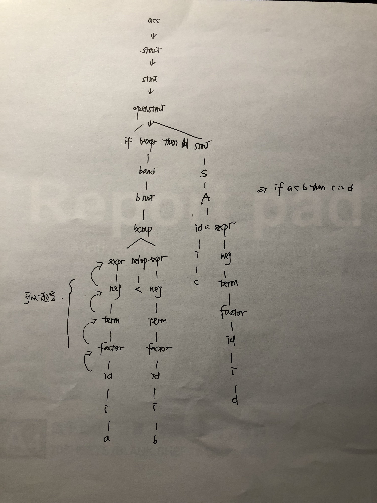

# intermediate-code-generator

intermediate code generater in c++

references:

https://www.cnblogs.com/sykline/p/13197470.html

### 目前完成的工作

- 词法分析和语法分析写了（抄了），稍微改编了一下，加了一堆注释。
  - 按照功能简单分成了不同的类，各种属性列表都是静态的全局可访问，类的方法都是静态方法。分的不是很严谨，做做样子。
- 语义分析和中间代码生成：目前只实现了最简单的赋值语句：id:=E

  - 前面的都做完了其他的应该也不是很麻烦，主要是布尔表达式和条件跳转语句的真假出口要斟酌一下

- 关于词法分析器/语法分析器和文法

  - 词/语法分析器抄的群里的 🔗 https://github.com/frederickmo/compiler

  - 文法是借的 zfn 组的https://github.com/melonedo/intermediate-code-generator , 他们用 python 写的代码量感觉少很多，尤其是用了一个词法/语法分析的框架 lark 直接输入语法生成状态转换表（据说 c++也有很多框架可以直接用，主要是我不会，而且短时间内也不好学，所以稍微绕了一些弯路），

  - 按照文法生成的 LALR 状态转换表：有一些地方其实是存在移进规约冲突的（跑一边代码就有提示）但是我试了一下简单的表达式似乎可以完成，有问题后面再说

  - 文法里面为了**保证各种代码逻辑的优先级**所以有很多层的非终结符递归归约，直接按照 PPT 上的

    

    这种输进去是做不到一个完成的状态转换表的~会有很多很多很多需要手动解决的移进规约冲突，所以如果写中间代码生成语句的翻译的过程的话，建议写的时候手动推导一下。

    举个例子：

    

- **按照算法分工作量是完全不行的，**因为后面布尔表达式以及条件跳转语句要构成一个完整的句子必须用到前面的赋值语句。所以应该按照顺序来才能正常进行。

  

  还有一点，**算法 7 不用写。**写 1-6 就行了。（如果有时间把 7 写了也行，zfn 他们组就写了。不过他们一个月前就开始写了)

- 接下来的工作量应该不是很多了，主要是要把 QuadrupleTranslator.h 里面的东西看懂，Tokenizer, GrammarAnalyzer 和 SemanticAnalyzer 如果没时间看的话当黑盒子用应该大概也行？大家加油

- 目前的输出只是个 demo 用来测试用的，最终的测试方式肯定不是现在这个样子

- 手推归约过程的时候 cmake-build-debug 文件夹里有 csv 格式的状态转换表，可以 copy 一份不用每次都生成一次

  - 为什么这个状态转换表有 700 多个状态呢？ => 因为是 LALR 合并的 LR(1)的状态集，LR(1)有 700 多个状态，LALR 合并以后没有重新编号，事实上只有 90 多种

    => 有空想重新编个号的可以试试，但感觉没必要，也可以正常用
